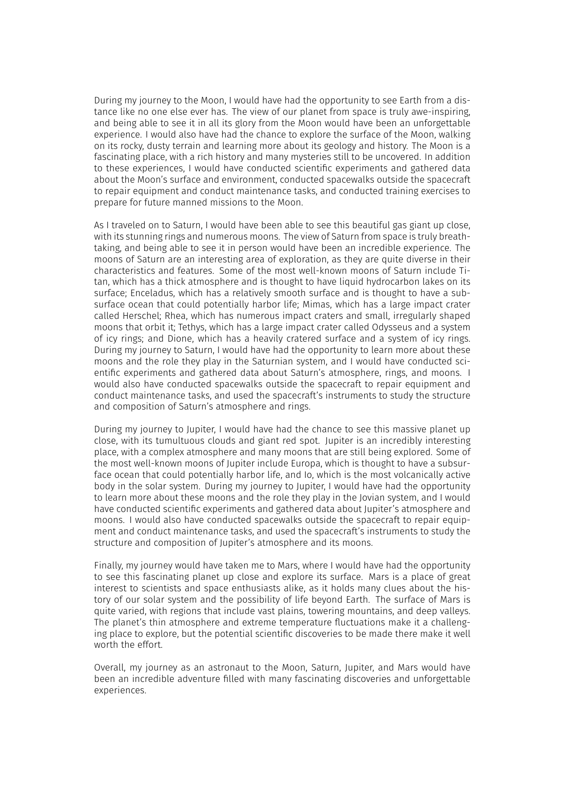

# zCv
An elegant LaTeX template for CV and cover letter.




## Usage

### Docker
The easiest way to compile the code and generate the pdf file is via the docker image. This way you don't have to install the texlive. Using the following command you can compile this [example](./example)
```bash
docker run -v $(pwd)/example:/workdir mhp1992/zcv latexmk -quiet --lualatex main.tex
```
### Texlive

If texlive is already installed on your machine, you can follow these instructions:  
* locate the `texmf-local` directory and copy the [zCv](./classes/zCv) to `../tex/latex/local` directory.
* Run ```texhash``` command
* Install required fonts from the [fonts](./fonts) directory.
* Compile the code with either `xelatex` or `lualatex`

## Build the docker image
The docker image is built based on the simplified version of texlive, including only the required packages. 
But it is quite flexible, allowing you to easily add the desired packages, fonts and custom classes. 
You can add extra packages by adding their name to this [file](./docker/tex-pkgs.txt). 
Finally, you can build the image

```bash
docker build -f docker/Dockerfile -t NAME:TAG .
```

## Change the title page images
The title page images are not static and these are the default ones. You can replace them by your desired image with the same name and format [here](./example/images).
## Limitation
The CV is designed as a one-page abstract style document. You need to maintain the total number of characters accordingly to avoid overflowing to the second page.  
## References
This work is heavily inspired by these two works:
* https://github.com/HarveySheppard/yLaTeX
* https://github.com/spagnuolocarmine/TwentySecondsCurriculumVitae-LaTex